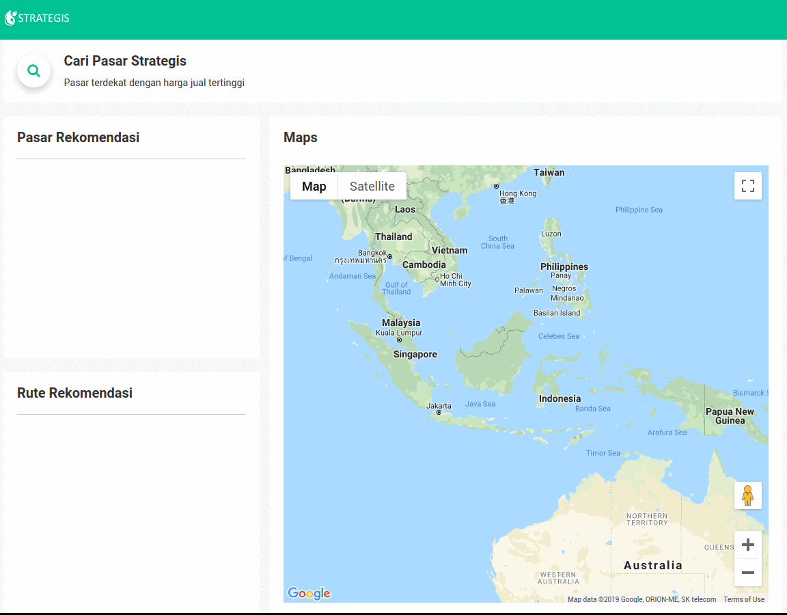

# K Means Clustering Implemented On Codeigniter To Find Strategic Market

[](https://opensource.org/licenses/MIT)
[](https://github.com/symfony/symfony)
<b><h2>Installation</h2></b>
<p>1 .You need to install composer, <a href="https://getcomposer.org/download/"> Read how to install composer</a></p>
<p>2. Install git, <a href="https://gist.github.com/derhuerst/1b15ff4652a867391f03"> Read how to install git</a></p>
<p>3. Clone repository with git</p>

```bash
git clone https://github.com/AlifAbhiesa/Codeigniter-K-Means-Clistering.git
```

<p> And Run Composer Update</p>

```bash
composer update
```

<p><b>4. Create your own Google API</b></p>
You need 3 google API, google maps API to show routes, geocoding for translating address into Geographic Coordinates, and Distance matrix to provides distance between two place. Read how to get the API <p>
<p>4.1. <a href="https://developers.google.com/maps/documentation/javascript/tutorial"> Read how to setup Google Maps API </a><p>
<p>4.1. <a href="https://developers.google.com/maps/documentation/geocoding/start"> Read how to setup Geocoding API </a><p>
<p>4.1. <a href="https://developers.google.com/maps/documentation/distance-matrix/start"> Read how to setup Distance Matrix API </a><p>
<p> <b>5. Configure Google API in your code </b><p>
<p> 5.1. Placing Maps API<p>
<p> Open file /application/views/default/index.php and place your API key here</p>

```html
 <script src="https://maps.googleapis.com/maps/api/js?key= YOUR API KEY" type="text/javascript"></script>
 ```
 
<p> 5.2. Placing Geocoding API<p>
<p> Open file /application/controller/Data.php and place your API key here</p>

```php
public function getGeo($location){
 $httpClient = new \Http\Adapter\Guzzle6\Client();
 $provider = new \Geocoder\Provider\GoogleMaps\GoogleMaps($httpClient, null, ' YOUR API KEY ');
 $geocoder = new \Geocoder\StatefulGeocoder($provider, 'en');
 $result = $geocoder->geocodeQuery(GeocodeQuery::create($location));
 $Longitude = $result->first()->getCoordinates()->getLongitude();
 $Latitude = $result->first()->getCoordinates()->getLatitude();
 $coordinates = array(
	 'Longitude' => $Longitude,
 	'Latitude' => $Latitude
 );
 return $coordinates;
}
 ```
 
<p> 5.2. Placing Distance Matrix API<p>
<p> Open file /application/controller/Data.php and place your API key here</p>

```php
public function distance($LatOri,$LongOri,$LatDes,$LongDes){
 $distance_data = file_get_contents('https://maps.googleapis.com/maps/api/distancematrix/json?&origins='.
 $LatOri.','.$LongOri.'&destinations='.$LatDes.','.$LongDes.'&key= YOUR API KEY');
 $distance_arr = json_decode($distance_data);
 $result = $distance_arr->rows;
 //result is a distance on Meter
 return $result[0]->elements[0]->distance->value;
}
 ```

<b><h2>Methode</h2></b>
<p> In this application i'm using 2 methode. K Means clustering to create the cluster of data, and Silhouette Coefficient to test the result cluster of K Means clustering. If you want to understand the flow of that method, you need to read this paper
<p> <a href="https://www.sciencedirect.com/science/article/pii/S1875389212006220"> 1. Paper of K Means Clustering </a>
<p> <a href="https://www.sciencedirect.com/science/article/pii/0377042787901257" > 2. Paper of Silhouette Coefficient </a>

<p><b><h2> Read Me </h2></b>
<b>Read Me on Medium</b>, <a href="https://medium.com/@abhiesa24/penentuan-pasar-strategis-menggunakan-metode-k-means-clustering-part-1-24f3ecad976f"> Story about this application by Alif Abhiesa </a>
